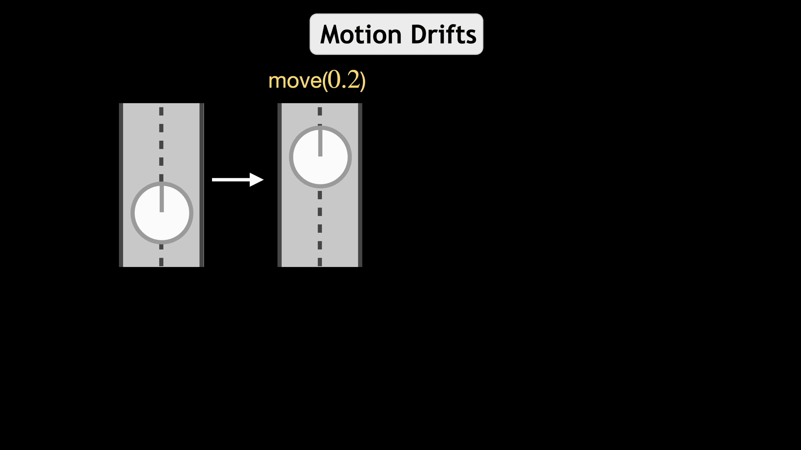

## [Moving Forward by Moving Backward: Embedding Action Impact over Action Semantics](https://prior.allenai.org/projects/action-adaptive-policy)

By Kuo-Hao Zeng, Luca Weihs, Roozbeh Mottaghi, and Ali Farhadi

[Paper](https://prior.allenai.org/assets/project-content/action-adaptive-policy/action-adaptive-policy.pdf) | [Video](https://youtu.be/KHsfoZ7Yvpk) | [BibTex](#citation)



A common assumption when training embodied agents is that the impact of taking an action is stable; for instance, executing the “move ahead” action will always move the agent forward by a fixed distance, perhaps with some small amount of actuator-induced noise. This assumption is limiting; an agent may encounter settings that dramatically alter the impact of actions: a move ahead action on a wet floor may send the agent twice as far as it expects and using the same action with a broken wheel might transform the expected translation into a rotation. Instead of relying that the impact of an action stably reflects its pre-defined semantic meaning, we propose to model the impact of actions on-the-fly using latent embeddings. By combining these latent action embeddings with a novel, transformer-based, policy head, we design an Action Adaptive Policy (AAP). We evaluate our AAP on two challenging visual navigation tasks in the AI2-THOR and Habitat environments and show that our AAP is highly performant even when faced, at inference-time with missing actions and, previously unseen, perturbed action space. Moreover, we observe significant improvement in robustness against these actions when evaluating in real-world scenarios.

### Installation

0. Requirements

   We implement this codebase on Ubuntu 18.04.3 LTS.

   In addition, this codebase needs to be executed on GPU(s).

1. Clone this repository

   ```
   git clone git@github.com:KuoHaoZeng/AAP.git
   ```
   
2. Intsall `xorg` if the machine does not have it

   **Note**: This codebase should be executed on GPU. Thus, we need `xserver`for GPU redering.

   ```
   # Need sudo permission to install xserver
   sudo apt-get install xorg
   ```

   Then, do the xserver refiguration for GPU

   ```
   sudo python scripts/startx.py
   ```

4. Using `conda`, create an environment and install the necessary packages

   **Note**: The `python` version we used is `3.8`.
   
   ```
   conda create -n aap python=3.8
   conda activate aap
   pip install -r requirements.txt; pip install -r dev_requirements.txt
   pip install -r allenact_plugins/robothor_plugin/extra_requirements.txt
   pip install -r allenact_plugins/clip_plugin/extra_requirements.txt
   ```

### Environment/Dataset

We consider Point Navigation (PointNav) and Object Navigation (ObjNav) tasks in [RoboTHOR](http://ai2thor.allenai.org/robothor) environment:

To download the data, simply use following commands:

   ```
   cd datasets
   sh download_navigation_datasets.sh robothor-pointnav
   sh download_navigation_datasets.sh robothor-objectnav
   cd ..c
   ```

For more information about how to control an agent in AI2-iTHOR, please vist this [webpage](https://ai2thor.allenai.org/robothor).

### Pretrained Models

We currently provide the following pretrained models:

|    PointNav  |                            Model                             |
| :----------: | :----------------------------------------------------------: |
|     AAP      | [Link](https://homes.cs.washington.edu/~khzeng/AAP/PointNav/aap.pt) |
|     Action Semantics  | [Link](https://homes.cs.washington.edu/~khzeng/AAP/PointNav/as.pt) |
|     LAC      | [Link](https://homes.cs.washington.edu/~khzeng/AAP/PointNav/lac.pt)|
|     NIE      | [Link](https://homes.cs.washington.edu/~khzeng/AAP/PointNav/nie.pt) |
|     EmbCLIP  | [Link](https://homes.cs.washington.edu/~khzeng/AAP/PointNav/EmbCLIP.pt)|


|    ObjNav   |                            Model                                  |
| :----------: | :----------------------------------------------------------: |
|     AAP      | [Link](https://homes.cs.washington.edu/~khzeng/AAP/ObjNav/aap.pt) |
|     NIE      | [Link](https://homes.cs.washington.edu/~khzeng/AAP/ObjNav/nie.pt) |
|     EmbCLIP  | [Link](https://homes.cs.washington.edu/~khzeng/AAP/ObjNav/EmbCLIP.pt) |

These models can be downloaded from the above links and should be placed into the `pretrained_model_ckpts`directory. For example:

   ```
   cd pretrained_model_ckpts/PointNav
   wget https://homes.cs.washington.edu/~khzeng/AAP/PointNav/AAP.pt
   cd ../..
   ```

You can then, for example, run inference for the `NIE` model on **ObsNav** using AllenAct by running:

```
PYTHONPATH=. python main.py projects/scmb/pointnav/robothor/action_adaptive_policy.py -s 12345 -c pretrained_model_ckpts/PointNav/AAP.pt -o eval_output/PointNav/aap --eval
```

### Train a new model from scratch with AllenAct

We use the [AllenAct framework](https://www.allenact.org/) for training the baseline models and our `AAP` models, the necessary packages for AllenAct are automatically installed when [installing the requirements for this project](#installation).

Let's say you want to train a `AAP` model on **PointNav** task. This can be easily done by running the command

```
PYTHONPATH=. python main.py projects/scmb/pointnav/robothor/action_adaptive_policy.py -s 12345 -o train_output/PointNav/aap
```

### Citation

If you find this project useful in your research, please consider citing our paper:

```
@inproceedings{khz2021interact,
  author = {Zeng, Kuo-Hao and Weihs, Luca and Mottaghi, Roozbeh and Farhadi, Ali},
  title = {Moving Forward by Moving Backward: Embedding Action Impact over Action Semantics},
  booktitle = {ICLR},	    
  year = {2023}
}
```

